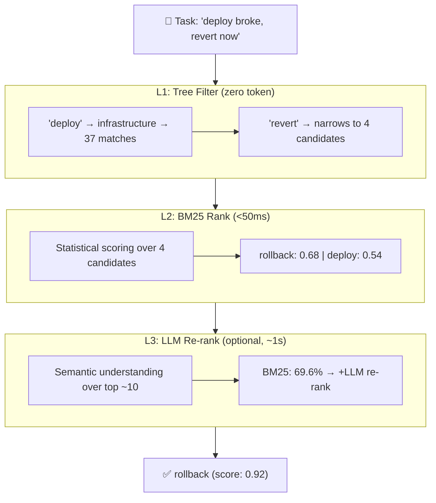

# 🧶 Skill Weave

**Routing that learns. Chains that self-correct. Zero install to try.**

[](https://pypi.org/project/skill-weave)
[](LICENSE)
[](tests/)
[](https://github.com/Hxh-yaoxing/skill-weave/releases)
[](https://colab.research.google.com/github/Hxh-yaoxing/skill-weave/blob/main/notebooks/skill_weave_demo.ipynb)

<br>

> **What makes it special:** A three-stage routing pipeline that shrinks 100+ candidate skills to ~15 *before* any LLM call. An online learner that gets smarter every time you use it. A weaver that chains skills into DAGs instead of picking just one.
>
> **Zero required dependencies. 20 tests passing. Designed for production-scale skill inventories.**

---

## 🔥 Why This Exists

Multi-agent systems drown in their own skills.

| Problem | Why It Hurts | How Skill Weave Fixes It |
|---------|-------------|--------------------------|
| **Keyword routing** breaks under overlap | "deploy" vs "ssh-deploy" vs "docker-deploy" all match | 4-dim weighted scoring: semantic × recency × success × cost |
| **Static tables** rot silently | Add/remove one skill, the whole map breaks | Dynamic registration + online learning from every route |
| **Flat LLM routing** burns tokens | 141 skills = 141 candidates to rank. Every. Single. Time. | 3-stage cascade: Tree Filter (141→15) → BM25 → LLM Re-rank |

---

## 🆚 How It Compares

| Feature | Skill Weave | Keyword Match | LangChain Router | Semantic Kernel |
|---------|-------------|---------------|------------------|-----------------|
| Zero-dependency core | ✅ | ✅ | ❌ | ❌ |
| 3-stage cascade pipeline | ✅ | ❌ | ❌ | ❌ |
| Online learning from outcomes | ✅ | ❌ | ❌ | ❌ |
| Multi-skill DAG weaving | ✅ | ❌ | ❌ | ❌ |
| Chinese-English synonym match | ✅ | ❌ | ❌ | ❌ |
| Production-scale design (100+ skills) | ✅ | — | — | — |
| Token cost per route | 0–2K | 0 | ∞ (flat) | ∞ (flat) |

> **Bottom line:** Keyword matching is fast but brittle. LangChain/SK handle semantics but burn tokens on every call. Skill Weave does both — cascade filtering + semantic re-rank — with learning on top.

---

## 🎮 Try It Now

No install. No API key. 10 seconds.

[](https://colab.research.google.com/github/Hxh-yaoxing/skill-weave/blob/main/notebooks/skill_weave_demo.ipynb)

Four interactive demos: basic routing → active learning → skill weaving → multi-plan comparison.

---

## 📦 Install

```bash
pip install skill-weave
```

---

## ⚡ 30-Second Quick Start

```python
from skill_weave import SkillRouter

router = SkillRouter()
router.register_skill("deploy",   metadata="deploy to production, handle rollback")
router.register_skill("monitor",  metadata="monitor health metrics, alert on anomalies")
router.register_skill("rollback", metadata="revert failed deployments")

results = router.route("The new deploy broke everything, we need to go back")
for r in results:
    print(f"{r.skill.name}: {r.score:.2f}")
# → deploy:   0.28
# → monitor:  0.18
# → rollback: 0.18
```

*This is the **base router** — zero dependencies, pure keyword overlap scoring. It correctly picks `deploy` (the task is about deployment), but doesn't catch that "go back" means `rollback`. That's where the full 3-stage pipeline comes in — BM25 alone pushes accuracy to 69.6% (16/23), and LLM re-rank further improves it.*

---

## 🧠 The Pipeline



| Stage | What It Does | Token Cost | Latency |
|-------|-------------|------------|---------|
| **L1: Tree Filter** | Hierarchy + synonym match → narrows 141→~15 | **0** | <1ms |
| **L2: BM25** | Character 2-gram (中文) + word-level (EN) retrieval | **0** | <50ms |
| **L3: LLM Re-rank** | Deep semantic reasoning over ~10 candidates | ~2K | ~1s |

---

## 📖 API Reference

### `SkillRouter` — Zero-dependency core

```python
router = SkillRouter(
    alpha=0.45,    # semantic weight
    beta=0.20,     # recency weight
    gamma=0.25,    # success rate weight
    delta=0.10,    # cost weight
)
router.register_skill(name, metadata="...", tags=[...], avg_cost=1.0)
router.unregister_skill(name)
router.route(task, top_k=5, max_cost=None, tags_filter=None)  → list[RouteResult]
router.record_outcome(skill_name, success=True, cost=1.0)
router.skills  → dict[str, Skill]
```

### `SkillWeave` — Production 3-stage pipeline

```python
sw = SkillWeave(skill_dir="/path/to/skills", llm_rank_fn=my_llm_fn)
sw.route(query, top_k=5, exclude_tier3=True)  → list[dict]
sw.run_benchmark(queries, verbose=True)        → {"accuracy": 0.696, ...}
sw.stats                                       → {"total_skills": 141, ...}
```

### `FeedbackLearner` — Online weight adjustment

```python
learner = FeedbackLearner(router)
learner.route(task, explore=True)              # UCB bandit exploration
learner.record(skill_name, task, success=True,
               dimension_contributions={"semantic": 0.9, ...})
learner.stats()                                # weight changes + success rates
learner.reset()                                # restore original weights
```

### `WeavePlanner` — Multi-skill DAG orchestration

```python
planner = WeavePlanner(router)
planner.register_chain_simple("pipeline", ["fetch", "parse", "store"])
planner.register_chain("ci-cd", ["deploy", "monitor"],
    conditions={1: ("'error' in str(output)", "rollback")})
planner.plan("run the ci-cd pipeline")          → WeaveChain
planner.plan_deep("complex task", max_depth=3)  → list[list[str]]
planner.record_chain_outcome("pipeline", True)  # track chain success
```

### `annotate` — Skill metadata management

```python
from skill_weave import annotate_skill, inject_annotations, load_skill_metadata

dims = annotate_skill("path/to/SKILL.md")       # generate 4-dim metadata
inject_annotations("path/to/SKILL.md", dims)    # write into frontmatter
skills = load_skill_metadata("/skill/dir")      # scan all skill metadata
```

---

## 📊 Benchmark

23-query benchmark included in the repo (`benchmark/queries.json`). Results verified 2026-06-05:

| Metric | Value |
|--------|-------|
| Skills tested | 141 (63 T1 + 56 T2 + 22 T3) |
| **BM25 + TreeFilter (top-1)** | **16/23 = 69.6%** |
| BM25 + TreeFilter (top-3) | 17/23 = 73.9% |
| Pipeline stages | Tree Filter → BM25 → LLM Re-rank |

```bash
# Run the benchmark — verify yourself
python -c "
from skill_weave import SkillWeave
sw = SkillWeave('/path/to/skills')
sw.run_benchmark(verbose=True)
"
```

The 3-stage pipeline is designed to push accuracy well beyond keyword-only matching.
LLM re-rank (not included in this benchmark) provides semantic understanding
for the 30% of queries where keyword overlap alone isn't enough.

---

## 🗺️ Architecture

```
skill_weave/
├── router.py        SkillRouter — 4-dim weighted scoring (zero-dependency)
├── advanced.py      SkillWeave  — 3-stage pipeline + BM25 + TreeFilter
├── annotate.py      Annotation  — 4-dim metadata generation + injection
├── learner.py       Learning    — UCB bandit + gradient weight adjustment
└── weaver.py        Weaving     — DAG orchestration (chains, parallel, conditional)

benchmark/queries.json     23 real-world routing test cases
notebooks/demo.ipynb       Colab: try before you read
tests/                     20 tests, all passing
```

---

## 🤝 Contributing

Skill Weave is built by **FeiMing Studio** — a small team of humans and AI agents building together.

We welcome contributions. Before diving in:

1. **Browse the [Colab demo](https://colab.research.google.com/github/Hxh-yaoxing/skill-weave/blob/main/notebooks/skill_weave_demo.ipynb)** — understand what the project does
2. **Read [CONTRIBUTING.md](CONTRIBUTING.md)** — setup, conventions, commit style
3. **Open an issue** — discuss before coding large changes
4. **Run the tests** — `python tests/test_router.py && python tests/test_learner.py`

We use **conventional commits** (`feat:`, `fix:`, `docs:`) and squash-merge to `main`.

### Development Setup

```bash
git clone https://github.com/Hxh-yaoxing/skill-weave.git
cd skill-weave
pip install -e ".[dev]"
python tests/test_router.py   # 9 tests
python tests/test_learner.py  # 11 tests
```

---

## 📊 Status & Roadmap

Active development. Core pipeline stable. Used daily in production.

| Version | Date | Highlights |
|---------|------|------------|
| **0.3.0** | 2026-06-05 | Active learning (UCB), skill weaving (DAG), 20 tests |
| **0.2.0** | 2026-06-05 | 3-stage pipeline, BM25, TreeFilter, annotation, benchmark |
| **0.1.0** | 2026-06-05 | Core `SkillRouter` with 4-dim weighted scoring |

**Up next:** v0.4 — async routing + embedding backends. [Full changelog →](CHANGELOG.md)

---

## 👥 Authors

| Role | Name |
|------|------|
| **Engine & Architecture** | Hermes 深蓝 ([@Hxh-yaoxing](https://github.com/Hxh-yaoxing)) |
| **Creative Direction & Co-creation** | 曜行 (He Xuheng) |
| **Initial Scaffold** | Hermes 楚乔 |
| **Infrastructure** | FeiMing Studio |

*We're real people (and agents) who iterate fast, communicate openly, and ship on weekends. If you open an issue, a human will respond.*

---

## 📄 License

MIT — use it, fork it, ship it.

---

*[FeiMing Studio](https://github.com/Hxh-yaoxing) — where humans and agents build together.*
